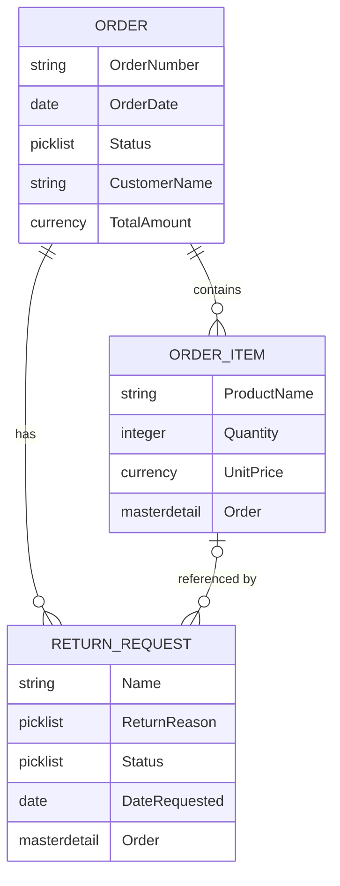

# Data Model

The portal's data model is intentionally small. Two custom objects carry the core
of the experience — **Order** and **Return Request** — with a third (**Order Item**)
planned to support item-level returns. Return *eligibility* is deliberately **not**
stored as data; it is computed in Apex from the order's date and status (see the
note below).

## ERD

> Note: GitHub renders the block above as a diagram automatically. The crow's-foot
> notation reads as: one Order has zero-or-many Return Requests; one Order contains
> zero-or-many Order Items; an Order Item may be referenced by zero-or-many Return
> Requests.

## Objects

### Order
Represents a customer's purchase. This is the central object the agent reads from
and the LWCs display.

| Field | Type | Notes |
|---|---|---|
| Order Number | Text (External ID) | Human-readable identifier customers reference |
| Order Date | Date | Used to compute return eligibility |
| Status | Picklist | Processing, Shipped, Delivered, Cancelled |
| Customer Name | Text | Simplified for the demo; a real org would relate to Contact/Account |
| Total Amount | Currency | Order total |

### Return Request
A customer's request to return all or part of an order. Child of Order.

| Field | Type | Notes |
|---|---|---|
| Name | Auto Number | Standard record name |
| Return Reason | Picklist | Defective, Wrong Item, No Longer Needed, Other |
| Status | Picklist | Requested, Approved, Denied, Completed |
| Date Requested | Date | When the customer submitted the request |
| Order | Master-Detail (Order) | The order being returned against |

### Order Item *(planned)*
An individual line item on an order, enabling item-level returns rather than
whole-order returns. Deferred to keep the initial build focused; see the roadmap.

| Field | Type | Notes |
|---|---|---|
| Product Name | Text | Item description |
| Quantity | Number | Units ordered |
| Unit Price | Currency | Price per unit |
| Order | Master-Detail (Order) | The parent order |

## Relationship Decisions

**Order → Return Request: Master-Detail.**
A return request has no meaning without an order to return against, so the tight
parent-child semantics of master-detail fit: a return cannot be orphaned, and if an
order record is removed its return requests go with it. Master-detail also enables
roll-up summaries on Order (e.g. a count of associated return requests), which a
lookup relationship would not. This decision is documented in full as an ADR.

**Order → Order Item: Master-Detail.**
Same reasoning — an order item belongs to exactly one order and shouldn't exist
independently.

## Why Eligibility Is Computed, Not Stored

Return eligibility ("is this order still within its return window?") is calculated
in Apex at request time from the Order Date and Status, rather than persisted as a
field. Storing it would mean a value that goes stale the moment the window lapses,
requiring scheduled updates to stay correct. Computing it on demand keeps a single
source of truth (the order date) and means the rule can change in one place. This
trade-off is captured as an ADR.
